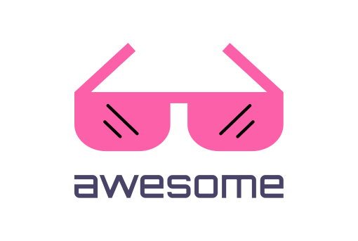

  

<h1 align="center">awesome-zambia</h1>

  A curated list of awesome things related to Zambian Tech</a>

  <i>Created by <a href="https://github.com/mwimwii" target="_blank">Mwila</a></i> 

## Sites

| Name | Description | Link | Date |
| ------------------------------------- | ---------------------------------------------------------------------------------------- | --------------------------------------------------------------------------------------- | ---------- |
| 21st.dev | Open source npm for shadcn/ui components. Also: Dribble for design engineers. Install UI components via shadcn CLI, or publish your own. | [Link](https://21st.dev/) | 2024-12-06 |

## License

This project is licensed under the MIT License - see the [LICENSE](LICENSE) file for details.

## Development & Contributing

### For the Website
- **Contributing**: Fork the repository, create a feature branch, and submit a PR

### For the Awesome List
- **Via GitHub**: Follow the [PR template](.github/pull_request_template.md) when creating pull requests
- **Guidelines**: Ensure resources are zambia-tech related, well-documented, and actively maintained
